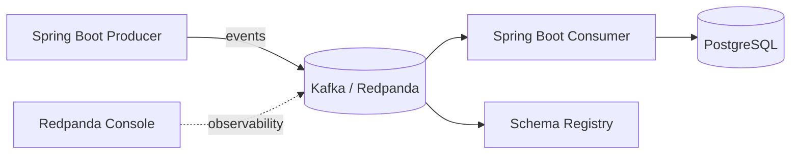

# Event-Driven Architecture Lab

Reference lab for exploring **event-driven and distributed system patterns** with Java, Spring Boot and Kafka-compatible messaging.

The repository is intentionally structured as a progressive architecture lab rather than a single demo application. Each stage introduces one concern at a time: local infrastructure, event contracts, producers and consumers, schema evolution, resilience, observability and failure scenarios.

> **Current status:** Module 01 — local event-driven infrastructure.

## Goals

- Explore event-driven architecture patterns in a reproducible local environment.
- Model explicit event contracts and evolve them safely over time.
- Build Spring Boot producers and consumers around Kafka-compatible messaging.
- Study service decoupling, asynchronous communication and delivery semantics.
- Introduce resilience, idempotency and observability incrementally.
- Experiment with broker and consumer failure scenarios in later modules.

## High-level architecture



The application components shown above are the target architecture for the lab.  
At the moment, the repository contains the infrastructure foundation required by the later modules.

## Technology stack

- **Java / Spring Boot** — application services introduced in upcoming modules
- **Redpanda** — Kafka-compatible event broker
- **Schema Registry** — event contract management
- **PostgreSQL** — persistence
- **Docker Compose** — reproducible local environment
- **JSON Schema** — planned event contract definition and evolution

## Roadmap

| Module | Focus | Status |
|---|---|---|
| 01 | Local infrastructure: Redpanda, Console, PostgreSQL | ✅ Available |
| 02 | Event contracts and schema compatibility | 🔜 Planned |
| 03 | Spring Boot event producer | 🔜 Planned |
| 04 | Spring Boot event consumer | 🔜 Planned |
| 05 | Contract evolution and backward compatibility | 🔜 Planned |
| 06 | Idempotency, retries and failure handling | 🔜 Planned |
| 07 | Metrics, tracing and observability | 🔜 Planned |
| 08 | Broker failure and consumer rebalancing scenarios | 🔜 Planned |

---

# Module 01 — Local Infrastructure

The current module provides the local development foundation for the lab:

- Redpanda single-broker cluster
- Redpanda Console
- PostgreSQL 18
- Persistent named volumes
- Health checks
- Separate internal and host listeners
- Verification scripts for Kafka and PostgreSQL

## Requirements

- Docker Desktop with Docker Compose v2
- At least 4 GB of free memory recommended

## Start

Copy the environment template.

### PowerShell

```powershell
Copy-Item .env.example .env
docker compose up -d
docker compose ps
```

Or:

```powershell
./scripts/start.ps1
```

### Bash / WSL

```bash
cp .env.example .env
chmod +x scripts/*.sh
./scripts/start.sh
```

## Endpoints

| Component | Host endpoint | Docker-network endpoint |
|---|---|---|
| Redpanda Console | http://localhost:8080 | `console:8080` |
| Kafka API | `localhost:19092` | `redpanda:9092` |
| Schema Registry | http://localhost:18081 | `http://redpanda:8081` |
| HTTP Proxy | http://localhost:18082 | `http://redpanda:8082` |
| Admin API | http://localhost:19644 | `http://redpanda:9644` |
| PostgreSQL | `localhost:5432` | `postgres:5432` |

PostgreSQL defaults are read from `.env`.

## Verify

### PowerShell

```powershell
./scripts/verify.ps1
```

### Bash / WSL

```bash
./scripts/verify.sh
```

The verification creates `lab.events` with three partitions and queries the sample `lab.orders` table.

## Manual Kafka smoke test

Create a topic:

```powershell
docker compose exec redpanda rpk topic create lab.manual --partitions 3 --replicas 1
```

Start a consumer in terminal A:

```powershell
docker compose exec redpanda rpk topic consume lab.manual --offset start
```

Produce messages in terminal B:

```powershell
docker compose exec redpanda rpk topic produce lab.manual
```

Enter one JSON object per line, then press `Ctrl+Z` and Enter on Windows, or `Ctrl+D` on Linux/WSL:

```json
{"eventId":"evt-001","type":"OrderCreated","orderId":1}
```

## PostgreSQL connection

```text
Host: localhost
Port: 5432
Database: eventlab
Username: eventlab
Password: eventlab_dev_password
```

From another Compose service, use host `postgres`, not `localhost`.

## Stop and reset

Stop containers while retaining data:

```powershell
docker compose down
```

Delete containers and all lab data:

```powershell
docker compose down -v
```

Initialization scripts run only when the PostgreSQL data volume is empty.  
After changing `postgres/init/001-init.sql`, reset with `docker compose down -v`.

## Design notes

This first module intentionally uses one Redpanda broker. Replication factor 1 is correct for this topology.

A multi-broker cluster is planned for a later module focused on partition leadership, broker failure and consumer rebalancing.

The development credentials and unsecured local configuration in this repository are intended for local experimentation only and must not be reused in production.

## Why this repository exists

The goal of this lab is not to present a production-ready platform. It is a hands-on environment for reasoning about architecture decisions and trade-offs in event-driven systems, with each concern introduced explicitly and incrementally.
