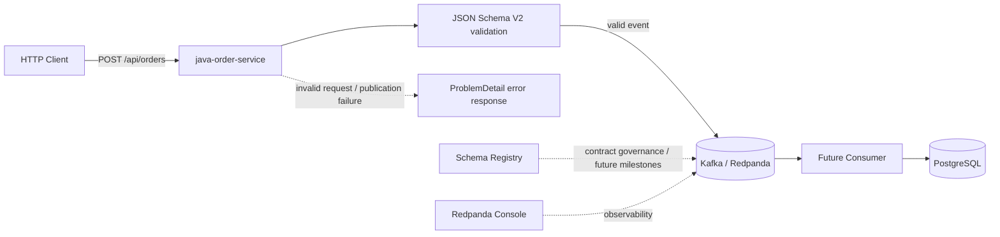

# Event-Driven Architecture Lab

Reference lab for exploring **event-driven and distributed system patterns** with Java, Spring Boot and Kafka-compatible messaging.

The repository is intentionally structured as a progressive architecture lab rather than a single demo application. Each stage introduces one concern at a time: local infrastructure, event contracts, producers and consumers, schema evolution, resilience, observability and failure scenarios.

> **Current milestone branch:** `milestone/m3-producer-contracts-v2-alignment`  
> Modules **01–03** are implemented on this branch: local infrastructure, JSON Schema event contracts, and a Spring Boot Kafka producer.

## Goals

- Explore event-driven architecture patterns in a reproducible local environment.
- Model explicit event contracts and evolve them safely over time.
- Build Spring Boot producers and consumers around Kafka-compatible messaging.
- Study service decoupling, asynchronous communication and delivery semantics.
- Introduce resilience, idempotency and observability incrementally.
- Experiment with broker and consumer failure scenarios in later modules.

## Current architecture



The producer currently writes **plain JSON** to Kafka. The Schema Registry is available in the local infrastructure, but the producer does **not** use a schema-aware wire format or schema IDs at runtime.

## Technology stack

- **Java 25**
- **Spring Boot 4.1**
- **Spring Kafka**
- **Redpanda** — Kafka-compatible event broker
- **Redpanda Schema Registry** — available locally for contract governance
- **PostgreSQL 18**
- **Docker Compose**
- **JSON Schema Draft 2020-12**
- **networknt json-schema-validator**
- **JUnit / Mockito / MockMvc**
- **Testcontainers Kafka**

## Roadmap

| Module | Focus | Status |
|---|---|---|
| 01 | Local infrastructure: Redpanda, Console, PostgreSQL | ✅ Available |
| 02 | Event contracts and local schema validation | ✅ Available |
| 03 | Spring Boot event producer | ✅ Available |
| 04 | Spring Boot event consumer | 🔜 Planned |
| 05 | Contract evolution and Schema Registry compatibility governance | 🔜 Planned |
| 06 | Idempotency, retries and failure handling | 🔜 Planned |
| 07 | Metrics, tracing and observability | 🔜 Planned |
| 08 | Broker failure and consumer rebalancing scenarios | 🔜 Planned |

---

# Module 01 — Local Infrastructure

The local development foundation includes:

- Redpanda single-broker cluster
- Redpanda Console
- Schema Registry endpoint
- PostgreSQL 18
- Persistent named volumes
- Health checks
- Separate internal and host listeners
- Verification scripts for Kafka and PostgreSQL

## Requirements

- Docker Desktop with Docker Compose v2
- Java 25 for `java-order-service`
- Python 3 + `jsonschema` for the contract validation script
- At least 4 GB of free memory recommended

## Start

Copy the environment template.

### PowerShell

```powershell
Copy-Item .env.example .env
docker compose up -d
docker compose ps
```

Or:

```powershell
./scripts/start.ps1
```

### Bash / WSL

```bash
cp .env.example .env
chmod +x scripts/*.sh
./scripts/start.sh
```

## Endpoints

| Component | Host endpoint | Docker-network endpoint |
|---|---|---|
| Redpanda Console | http://localhost:8080 | `console:8080` |
| Kafka API | `localhost:19092` | `redpanda:9092` |
| Schema Registry | http://localhost:18081 | `http://redpanda:8081` |
| HTTP Proxy | http://localhost:18082 | `http://redpanda:8082` |
| Admin API | http://localhost:19644 | `http://redpanda:9644` |
| PostgreSQL | `localhost:5432` | `postgres:5432` |

PostgreSQL defaults are read from `.env`.

## Verify infrastructure

### PowerShell

```powershell
./scripts/verify.ps1
```

### Bash / WSL

```bash
./scripts/verify.sh
```

The verification creates `lab.events` with three partitions and queries the sample `lab.orders` table.

---

# Module 02 — Event Contracts

The source of truth for the `order.created` contracts is:

```text
contracts/registry/order-created/
├── v1.schema.json
├── v2.schema.json
└── breaking.schema.json
```

The producer milestone uses **OrderCreated V2**.

V2 adds the optional `salesChannel` field:

```text
WEB | MOBILE | STORE
```

The envelope contains:

```text
eventId
eventType
eventVersion
occurredAt
producer
correlationId
causationId
aggregateId
payload
```

## Validate contracts locally

From the repository root:

```powershell
python contracts/scripts/validate-contracts.py
```

The validation script checks:

- the JSON Schemas themselves;
- valid V1 and V2 examples;
- invalid examples;
- the intentionally breaking schema.

The Java service also embeds `v2.schema.json` at build time and validates every generated `OrderCreatedEvent` against it **before** publishing to Kafka.

Current runtime strategy:

```text
Java event
  -> Jackson plain JSON
  -> local JSON Schema V2 validation
  -> Kafka
```

Schema Registry registration and automated compatibility gates are intentionally left for a later contract-governance milestone.

---

# Module 03 — Spring Boot Kafka Producer

The producer is implemented in:

```text
java-order-service/
```

It follows a lightweight hexagonal structure:

```text
adapter.in.web
      |
      v
application.port.in
      |
      v
application.service
      |
      +--> application.port.out.ValidateOrderCreatedPort
      |           |
      |           v
      |     adapter.out.validation
      |
      +--> application.port.out.PublishOrderCreatedPort
                  |
                  v
            adapter.out.kafka
```

## Producer flow

```text
POST /api/orders
  -> Bean Validation
  -> OrderWebMapper
  -> CreateOrderService
  -> calculate totalAmount
  -> build OrderCreatedEvent V2
  -> validate against JSON Schema V2
  -> KafkaOrderCreatedPublisher
  -> orders.created.v1
```

The Kafka record key is the order aggregate id:

```text
key = aggregateId = orderId
```

This keeps events for the same order on the same partition and allows per-order ordering.

## Kafka producer configuration

The service is configured with:

- broker: `localhost:19092`
- topic: `orders.created.v1`
- key serializer: `StringSerializer`
- value serializer: `JacksonJsonSerializer`
- `enable.idempotence=true`
- `acks=all`
- Spring Java type headers disabled

## Run the service

Start the infrastructure first, then:

```powershell
cd java-order-service
./mvnw.cmd spring-boot:run
```

The HTTP API listens on:

```text
http://localhost:8081
```

Actuator exposes:

```text
/actuator/health
/actuator/info
/actuator/metrics
```

## Create an order

```http
POST http://localhost:8081/api/orders
Content-Type: application/json

{
  "orderId": "ORD-1001",
  "customerId": "CUS-501",
  "currency": "EUR",
  "salesChannel": "WEB",
  "items": [
    {
      "productId": "PROD-101",
      "quantity": 2,
      "unitPrice": 19.90
    },
    {
      "productId": "PROD-202",
      "quantity": 1,
      "unitPrice": 10.50
    }
  ],
  "correlationId": "0ef035ea-e428-437c-8bb2-5df84da91620",
  "causationId": null
}
```

Expected response:

```http
HTTP/1.1 201 Created
Content-Type: application/json
```

```json
{
  "orderId": "ORD-1001",
  "eventId": "<generated-uuid>",
  "totalAmount": 50.30,
  "status": "PUBLISHED"
}
```

The response is completed only after the Kafka publication future completes successfully.

## Inspect the produced record

```powershell
docker compose exec redpanda rpk topic consume orders.created.v1 --offset start
```

A produced record has the order id as key and an `OrderCreated` V2 JSON value.

## Request validation

Example invalid request:

```http
POST http://localhost:8081/api/orders
Content-Type: application/json

{
  "orderId": "",
  "customerId": "",
  "currency": "euro",
  "items": []
}
```

Expected response:

```http
HTTP/1.1 400 Bad Request
Content-Type: application/problem+json
```

The response uses Spring `ProblemDetail` and includes:

```json
{
  "title": "Request validation failed",
  "status": 400,
  "code": "REQUEST_VALIDATION_FAILED",
  "errors": []
}
```

Other mapped failures include:

| Scenario | HTTP status | Problem code |
|---|---:|---|
| Request validation failure | 400 | `REQUEST_VALIDATION_FAILED` |
| Invalid mapped request data | 400 | `INVALID_REQUEST_DATA` |
| Event contract violation | 500 | `EVENT_CONTRACT_VIOLATION` |
| Kafka publication unavailable | 503 | `EVENT_PUBLICATION_UNAVAILABLE` |
| Unexpected failure | 500 | `INTERNAL_ERROR` |

## Tests

The producer milestone includes:

- domain invariant tests;
- application service tests;
- MVC controller/error handling tests;
- JSON Schema validator tests;
- Kafka publisher integration tests with Testcontainers;
- partitioning and per-key ordering integration tests.

Run:

```powershell
cd java-order-service
./mvnw.cmd clean verify
```

The Kafka integration tests verify that:

- the event is serialized and consumed correctly;
- the Kafka key is `aggregateId`;
- events with the same key reach the same partition;
- their offsets preserve publication order.

## Current producer milestone result

The producer milestone currently demonstrates:

- ✅ Java 25 / Spring Boot 4.1 service
- ✅ REST create-order endpoint
- ✅ V2 event envelope
- ✅ total amount calculated server-side
- ✅ JSON Schema runtime validation before publish
- ✅ plain JSON publication to Redpanda
- ✅ aggregate-based Kafka key
- ✅ idempotent Kafka producer configuration
- ✅ structured HTTP error handling
- ✅ unit, MVC and Kafka integration tests
- ✅ partitioning and ordering checks

The next lab step is to build the consumer and, separately, evolve contract governance around Schema Registry compatibility.

---

# PostgreSQL connection

```text
Host: localhost
Port: 5432
Database: eventlab
Username: eventlab
Password: eventlab_dev_password
```

From another Compose service, use host `postgres`, not `localhost`.

## Stop and reset

Stop containers while retaining data:

```powershell
docker compose down
```

Delete containers and all lab data:

```powershell
docker compose down -v
```

Initialization scripts run only when the PostgreSQL data volume is empty. After changing `postgres/init/001-init.sql`, reset with `docker compose down -v`.

## Design notes

The lab currently uses one Redpanda broker. Replication factor 1 is correct for this topology.

A multi-broker cluster is planned for a later module focused on partition leadership, broker failure and consumer rebalancing.

The development credentials and unsecured local configuration in this repository are intended for local experimentation only and must not be reused in production.

## Why this repository exists

The goal of this lab is not to present a production-ready platform. It is a hands-on environment for reasoning about architecture decisions and trade-offs in event-driven systems, with each concern introduced explicitly and incrementally.
